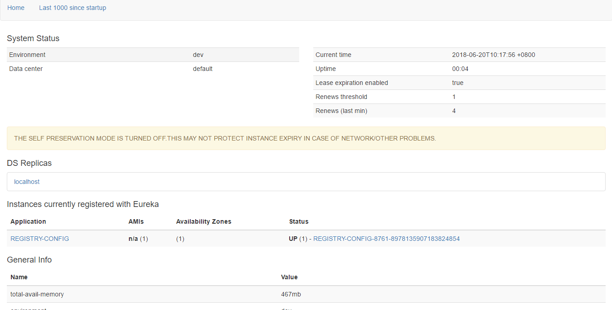
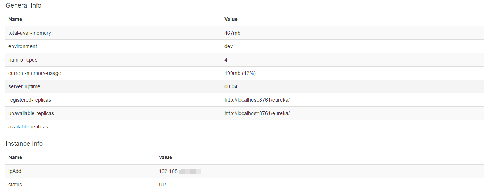
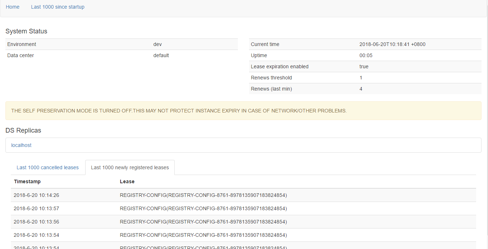

# Registry-Config
-----

这是一个学习Spring Cloud Config Server 和Eureka注册中心的示例项目，希望学习者拥有Spring Cloud Config和Spring Boot的基本知识。
  
本项目是结合Spring Cloud Config Server和Eureka的多模块注册配置中心，可用于服务注册、服务发现、远程配置获取。  
在registry模块的templates中提供重新编辑的eureka dashboard模板，templates中是基于原dashboard优化的页面，  
用户可以使用这个方式定制自己的页面，这里只给出一个自定义页面的例子。

